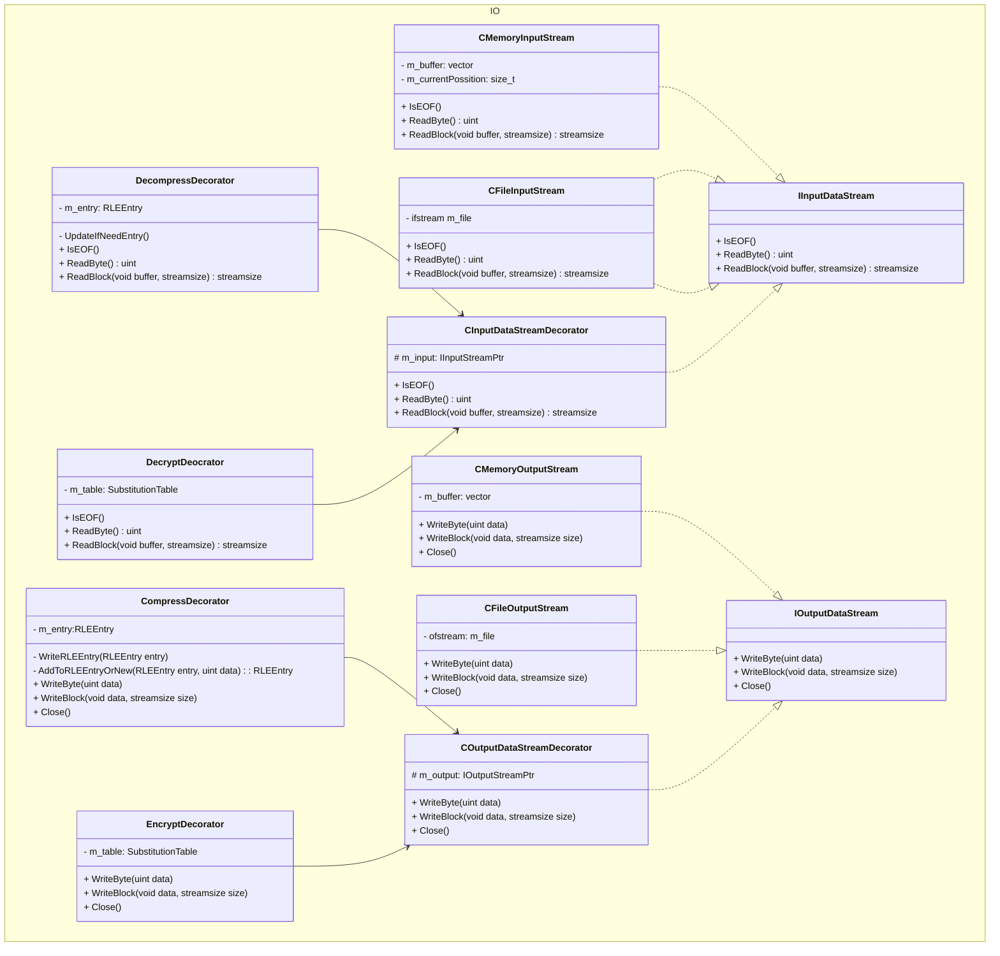

classDiagram
IComponent <|.. Component

    IComponent <|.. ComponentDecorator
    ComponentDecorator o-- IComponent

    ComponentDecorator <|-- ComponentDecoratorA
    ComponentDecorator <|-- ComponentDecoratorB

    class IComponent {
        + Operation()
    }

    class Component {
        + Operation()
    }

    class ComponentDecorator {
        + Operation()
        - IComponent m_component
    }

    class ComponentDecoratorA {
        + Operation()
        - SomeA()
    }

    class ComponentDecoratorB {
        + Operation()
        - SomeB()
    }

---
classDiagram

    IBeverage <|.. CBeverage

    CBeverage <|-- CCoffee

    CBeverage <|-- CTea
    TeaType <.. CTea : "Use"

    CBeverage <|-- CMilkshake
    MilkshakeSizeType <.. CMilkshake : "Use"

    CCoffee <|-- CCappuccino
    CCoffee <|-- CLatte

    namespace Beverage {
        class IBeverage {
            + GetDescription() string
            + GetInfo() double
        }

        class CBeverage {
            + GetDescription() string
            - string m_description
        }

        class CCoffee {
            + GetInfo() double
        }

        class CCappuccino {
            + GetInfo() double
            - bool m_isDoublePortion
        }

        class CLatte {
            + GetInfo() double
            - bool m_isDoublePortion
        }

        class TeaType {
            <<Enumuration>>
            BLACK,
            GREEN,
            RED
        }

        class CTea {
            + GetInfo() double
            - TeaType m_type
        }

        class MilkshakeSizeType {
            <<Enumuration>>
            SMALL,
            MEDIUM,
            LARGE
        }

        class CMilkshake {
            + GetInfo() double
            - MilkshakeSize m_size
        }
    }

    IBeverage <|.. CCondimentDecorator

    CCondimentDecorator *-- IBeverage
    CCondimentDecorator <|-- CCinnamon
    CCondimentDecorator <|-- CLemon
    CCondimentDecorator <|-- CIceCubes
    IceCubeType <.. CIceCubes : "Use"

    CCondimentDecorator <|-- CSyrup
    SyrupType <.. CSyrup : "Use"

    CCondimentDecorator <|-- CChocolateCrumbs

    CCondimentDecorator <|-- CCoconutFlakes

    namespace Condiment {
        class CCondimentDecorator {
            + GetDescription() string
            + GetInfo() double
            + GetCondimentCost() double*
            + GetCondimentDescription() string*
            - IBeveragePtr m_beverage
        }

        class CCinnamon {
            # GetCondimentCost() double
            # GetCondimentDescription() string
        }

        class CLemon {
            # GetCondimentCost() double
            # GetCondimentDescription() string
            - unsigned m_quantity
        }

        class IceCubeType {
            <<Enumuration>>
            Dry,
            Water
        }

        class CIceCubes {
            # GetCondimentCost() double
            # GetCondimentDescription() string
            - unsigned m_quantity
            - IceCubeType m_type
        }

        class SyrupType {
            <<Enumuration>>
            Chocolate,
            Maple
        }

        class CSyrup {
            # GetCondimentCost() double
            # GetCondimentDescription() string
            - SyrupType m_syrupType
        }

        class CChocolateCrumbs {
            + GetCondimentCost() double
            + GetCondimentDescription() string
            - unsigned m_mass
        }

        class CCoconutFlakes {
            # GetCondimentCost() double
            # GetCondimentDescription() string
            - unsigned m_mass
        }
    }   

