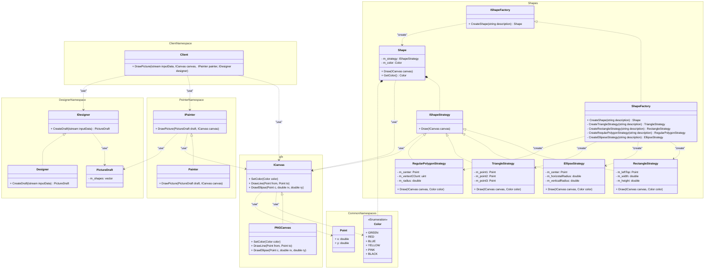

```mermaid
classDiagram

    namespace ClientNamespace{
        class Client {
        + DrawPicture(istream inputData, ICanvas canvas,  IPainter painter, IDesigner designer)
        }   
    }
    Client ..> ICanvas: "use"
    Client ..> IPainter: "use"
    Client ..> IDesigner: "use"

    namespace PeinterNamespace {
    class IPainter {
        + DrawPicture(PictureDraft draft, ICanvas canvas)
    }

    class Painter {
        + DrawPicture(PictureDraft draft, ICanvas canvas)
    }
    }
    IPainter <|.. Painter
    IPainter ..> ICanvas : "use"
    IPainter ..> PictureDraft: "use"
   

    namespace gfx {
        class ICanvas {
            + SetColor(Color color)
            + DrawLine(Point from, Point to)
            + DrawEllipse(Point c, double rx, double ry)
        }

        class PNGCanvas {
            + SetColor(Color color)
            + DrawLine(Point from, Point to)
            + DrawEllipse(Point c, double rx, double ry)
        }
    }
    ICanvas <|.. PNGCanvas
    ICanvas ..> Color: "use"
    ICanvas ..> Point: "use"


    namespace DesignerNamespace {
        class PictureDraft {
            - m_shapes: vector<Shape> 
        }

        class IDesigner {
            + CreateDraft(istream inputData) PictureDraft
        }
        
        class Designer {
            + CreateDraft(istream inputData) PictureDraft
        }
    }   
    IDesigner ..> PictureDraft: "use"
    IDesigner <|.. Designer


    namespace CommonNamespaces {
    class Color {
        <<Enumeration>>
        + GREEN
        + RED
        + BLUE
        + YELLOW
        + PINK
        + BLACK
    }

    class Point {
        +  x: double
        +  y: double
    }
    }
    

    namespace Shapes {
        class IShapeFactory {
            + CreateShape(string description) Shape

        }

        class ShapeFactory {
            + CreateShape(string description) Shape
            - CreateTriangleStrategy(string description) TriangleStrategy
            - CreateRectangleStrategy(string description) RectangleStrategy
            - CreateReqularPolygonStrategy(string description) RegularPolygonStrategy
            - CreateEllipeseStrategy(string description) EllipseStrategy
        }

        class Shape {
            - m_strategy: IShapeStrategy 
            - m_color: Color 

            + Draw(ICanvas canvas)
            + GetColor() Color 
        }

        class IShapeStrategy {
            + Draw(ICanvas canvas)
        }

        class RectangleStrategy {
            - m_leftTop: Point 
            - m_width: double 
            - m_height: double 

            + Draw(ICanvas canvas, Color color)
        }

        class EllipseStrategy {
            - m_center: Point 
            - m_horizotalRadius: double 
            - m_verticalRadius: double 

            + Draw(ICanvas canvas, Color color)
        }

        class TriangleStrategy {
            - m_point1: Point 
            - m_point2: Point 
            - m_point3: Point       

            + Draw(ICanvas canvas, Color color)
        }

        class RegularPolygonStrategy {
            - m_center: Point 
            - m_vertextCOunt: uint 
            - m_radius: double   

            + Draw(ICanvas canvas, Color color)
        }
    }
    IShapeStrategy <|.. RectangleStrategy
    IShapeStrategy <|.. EllipseStrategy
    IShapeStrategy <|.. TriangleStrategy
    IShapeStrategy <|.. RegularPolygonStrategy

    IShapeFactory <|.. ShapeFactory
    IShapeFactory ..> Shape: "create"

    ShapeFactory ..> RectangleStrategy: "create"
    ShapeFactory ..> EllipseStrategy: "create"
    ShapeFactory ..> TriangleStrategy: "create"
    ShapeFactory ..> RegularPolygonStrategy: "create"

    Shape *.. IShapeStrategy
    Shape ..> ICanvas : "use"
    IShapeStrategy ..> ICanvas : "use"

    Shape *.. Color
```