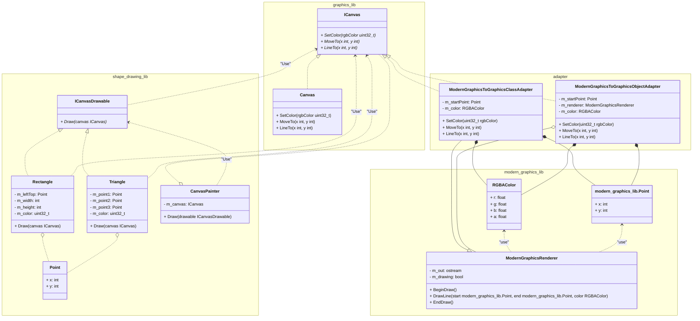

```mermaid
classDiagram
    ICanvas <|.. Canvas

    namespace graphics_lib {
        class ICanvas {
            + SetColor(rgbColor uint32_t)*
            + MoveTo(x int, y int)*
            + LineTo(x int, y int)*
        }

        class Canvas {
            + SetColor(rgbColor uint32_t)
            + MoveTo(x int, y int)
            + LineTo(x int, y int)
        }
    }

    ICanvas <.. ICanvasDrawable : "Use"
    ICanvas <.. Triangle : "Use"
    ICanvas <.. Rectangle : "Use"
    ICanvasDrawable <|.. Triangle
    ICanvasDrawable <|.. Rectangle
    Triangle o.. Point
    Rectangle o.. Point
    CanvasPainter o.. ICanvas
    ICanvasDrawable <.. CanvasPainter : "Use"
    namespace shape_drawing_lib {
        class Point {
            + x: int
            + y: int
        }

        class ICanvasDrawable {
            + Draw(canvas ICanvas)*
        }

        class Triangle {
            + Draw(canvas ICanvas)
            - m_point1: Point
            - m_point2: Point
            - m_point3: Point
            - m_color: uint32_t
        }

        class Rectangle {
            + Draw(canvas ICanvas)
            - m_leftTop: Point
            - m_width: int
            - m_height: int
            - m_color: uint32_t
        }

        class CanvasPainter {
            + Draw(drawable ICanvasDrawable)
            - m_canvas: ICanvas
        }
    }

    modern_graphics_lib.Point <.. ModernGraphicsRenderer : "use"
    RGBAColor <.. ModernGraphicsRenderer : "use"
    namespace modern_graphics_lib {
        class RGBAColor {
            + r: float
            + g: float
            + b: float
            + a: float
        }

        class modern_graphics_lib.Point {
            + x: int
            + y: int
        }

        class ModernGraphicsRenderer {
            + BeginDraw()
            + DrawLine(start modern_graphics_lib.Point, end modern_graphics_lib.Point, color RGBAColor)
            + EndDraw()
            - m_out: ostream
            - m_drawing: bool
        }
    }

    ICanvas <|.. ModernGraphicsToGraphicsObjectAdapter
    ModernGraphicsToGraphicsObjectAdapter o-- ModernGraphicsRenderer
    ModernGraphicsToGraphicsObjectAdapter *-- modern_graphics_lib.Point
    ModernGraphicsToGraphicsObjectAdapter *-- RGBAColor

    ICanvas <|.. ModernGraphicsToGraphicsClassAdapter
    ModernGraphicsToGraphicsClassAdapter --|> ModernGraphicsRenderer
    ModernGraphicsToGraphicsClassAdapter *-- modern_graphics_lib.Point
    ModernGraphicsToGraphicsClassAdapter *-- RGBAColor
    namespace adapter {
        class ModernGraphicsToGraphicsObjectAdapter {
            + SetColor(uint32_t rgbColor)
            + MoveTo(x int, y int)
            + LineTo(x int, y int)
            - m_startPoint: Point
            - m_renderer: ModernGraphicsRenderer
            - m_color: RGBAColor
        }

        class ModernGraphicsToGraphicsClassAdapter {
            + SetColor(uint32_t rgbColor)
            + MoveTo(x int, y int)
            + LineTo(x int, y int)
            - m_startPoint: Point
            - m_color: RGBAColor
        }
    }
```