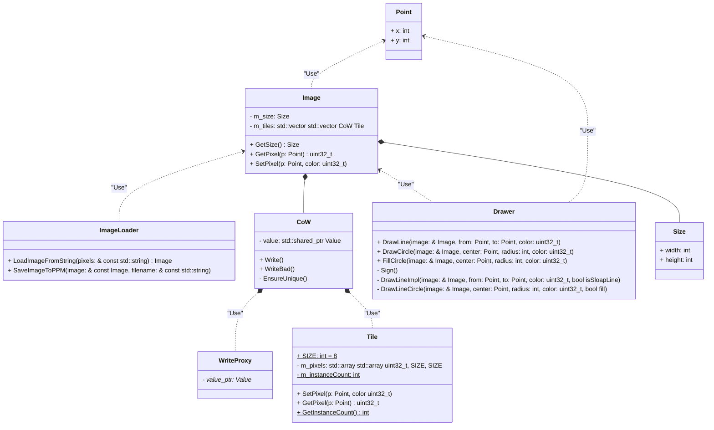

```mermaid
classDiagram
    Image <.. ImageLoader : "Use"

    CoW *.. WriteProxy : "Use"
    CoW *.. Tile : "Use"

    Image <.. Drawer : "Use"
    Point <.. Drawer : "Use"

    Image *-- CoW
    Image *-- Size
    Point <.. Image : "Use"

    class ImageLoader {
        + LoadImageFromString(pixels: & const std::string) Image
        + SaveImageToPPM(image: & const Image, filename: & const std::string)
    }

    class Drawer {
        + DrawLine(image: & Image, from: Point, to: Point, color: uint32_t)
        + DrawCircle(image: & Image, center: Point, radius: int, color: uint32_t)
        + FillCircle(image: & Image, center: Point, radius: int, color: uint32_t)
        - Sign()
        - DrawLineImpl(image: & Image, from: Point, to: Point, color: uint32_t, bool isSloapLine)
        - DrawLineCircle(image: & Image, center: Point, radius: int, color: uint32_t, bool fill)
    }

    class WriteProxy {
        - value_ptr: Value*
    }

    class CoW {
        + Write()
        + WriteBad()
        - value: std::shared_ptr Value
        - EnsureUnique()
    }

    class Image {
        + GetSize() Size
        + GetPixel(p: Point) uint32_t
        + SetPixel(p: Point, color: uint32_t)
        - m_size: Size
        - m_tiles: std::vector std::vector CoW Tile
    }

    class Tile {
        + SIZE: int = 8 $
        + SetPixel(p: Point, color uint32_t)
        + GetPixel(p: Point) uint32_t
        + GetInstanceCount() int $
        - m_pixels: std::array std::array uint32_t, SIZE, SIZE
        - m_instanceCount: int $
    }

    class Point {
        + x: int
        + y: int
    }

    class Size {
        + width: int
        + height: int
    }
```